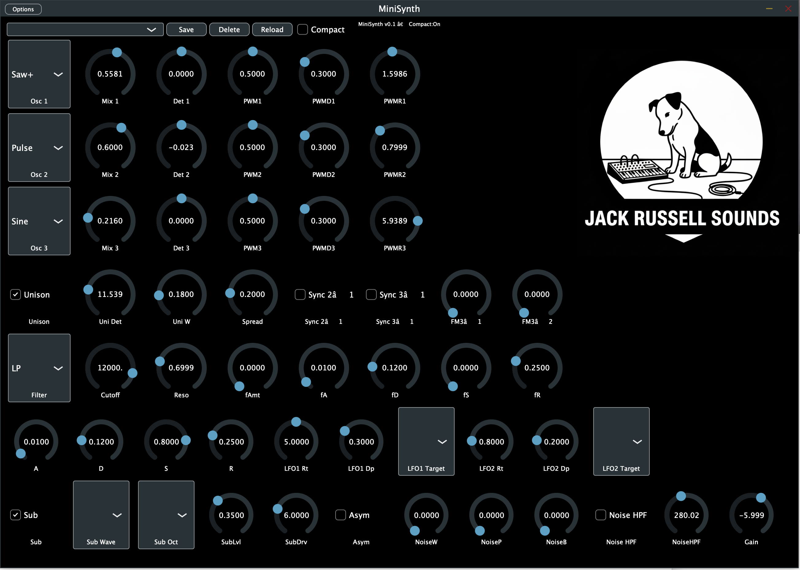

# MiniSynth

My first VST synthesiser

This is a polyphonic synthesiser implemented in C++ (with JUCE).
Implemented and tested on MacOS (arm M1).

An external midi device (like a usb keyboard) is required to make sounds! 
If you are running the standalone version, any MIDI devices connected to your computer should be automatically detected.

Yes... I know... The graphical interface is ugly. ;-)

3 main oscillators, 1 noise generator, PWM, ...
Well, there's sound coming out. 
But the preset menu isn't working yet. 
The interface needs to be completely redesigned to make it more user-friendly. 
The ADSR, which should manage the amplitude envelope, doesn't seem to be working...

## How to compile this project
	
### Quick steps (macOS Apple Silicon or Intel)

#### Prerequisites
Install Xcode (from the App Store), then:
	xcode-select --install
Install CMake and Git (if needed):
	brew install cmake git

#### Clone the project wherever you want.
	git clone https://github.com/jschlaepfer/MiniSynth.git

#### Add JUCE as a submodule:
	cd MiniSynth
	git init
	git submodule add https://github.com/juce-framework/JUCE JUCE

#### Build and compile (Xcode)
	cmake -B build -G Xcode
	cmake --build build --config Debug

The binary files are usually located here:
	build/Debug/MiniSynth_artefacts/Debug/

#### Installation (optional)

Simply copy the VST3 and AU binaries to the standard directories:

	cp -R build/Debug/MiniSynth_artefacts/Debug/VST3/MiniSynth.vst3 ~/Library/Audio/Plug-Ins/VST3/
	cp -R build/Debug/MiniSynth_artefacts/Debug/AU/MiniSynth.component ~/Library/Audio/Plug-Ins/Components/

Then open a host (GarageBand/Logic for AU, REAPER for AU/VST3) and load MiniSynth.
Enjoy!